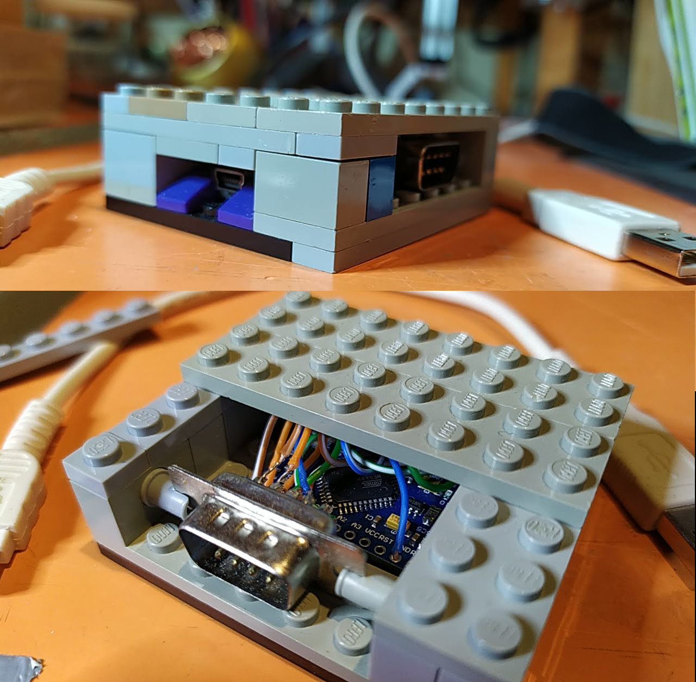

# USB Amiga Joystick adapter



Simple Double DB9 Joystick adapter to plug your old Amiga/Atari/Sega controllers
through USB to a modern PC.

Most of the code is borrowed from the Arduino Joystick Library examples.

If you're using this on a Linux computer, make sure to add the following to your kernel command line:

```
usbhid.quirks=0x2341:0x8037:0x040
```

or else you won't see both Joysticks.

